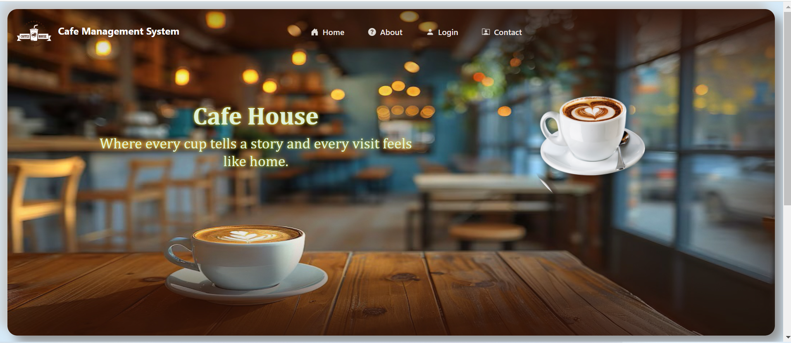
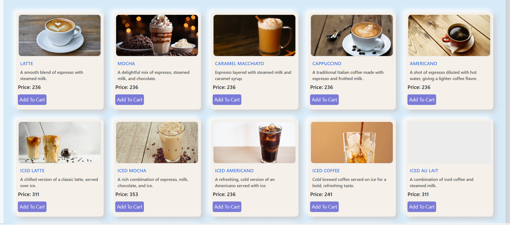
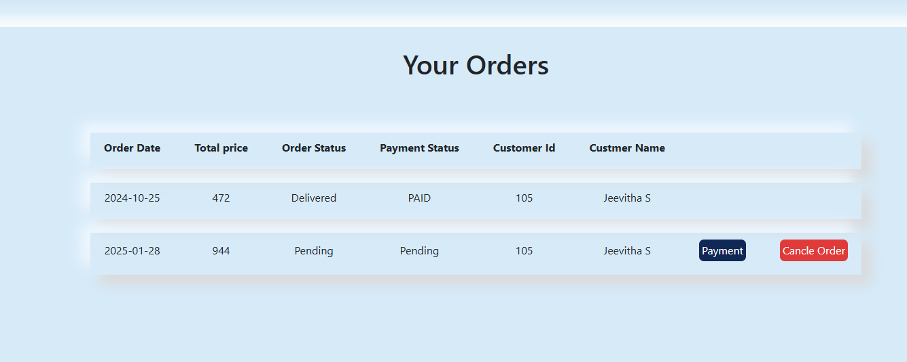
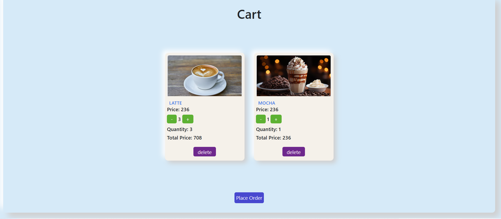
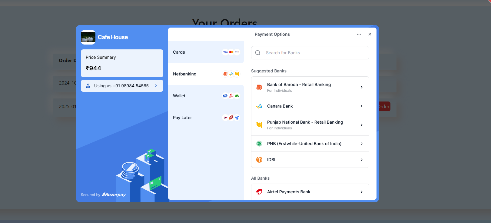
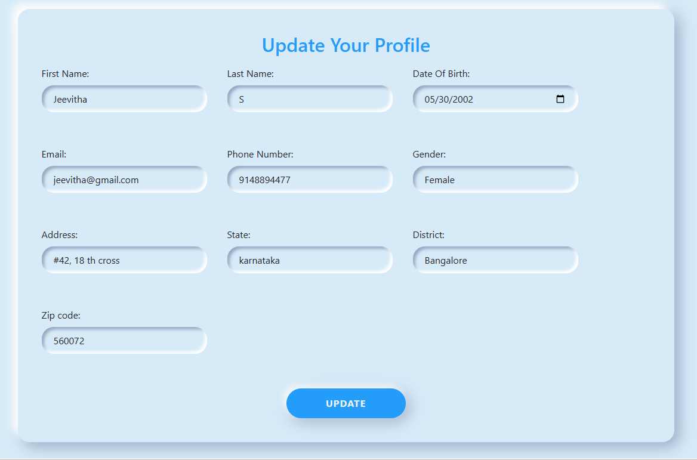

# Cafe Management System

Welcome to the **Cafe Management System**, a modern web application designed to simplify and enhance the experience of managing a cafe. With features like menu browsing, order placement, cart management, payment processing, and customer profiles, this system offers a seamless experience for both customers and administrators.

## 🚀 Features

### Home
- A visually appealing landing page introducing the cafe.
- Displays highlights and popular items.
  

### Menu
- Showcases a variety of coffee options and other items.
- Categories and filters for easy navigation.
- Supports adding items to the cart.
  

### Order
- Allows users to place orders conveniently.
- Displays order details for review before finalizing.
  

### Cart
- Lists selected items with quantities and prices.
- Options to modify or remove items.
- Proceed to payment button for checkout.
  

### Payment
- Secure and simple payment gateway integration.
- Supports multiple payment methods.
- 

### Profile
- Personal details and order history for users.
- Allows updating of customer information.
 

## 🛠️ Technologies Used

- **Frontend**: Angular, HTML5, CSS3, Bootstrap
- **Backend**: Spring Boot (Java)
- **Database**: MySQL / PostgreSQL
- **API Testing**: Postman
- **Version Control**: Git & GitHub

